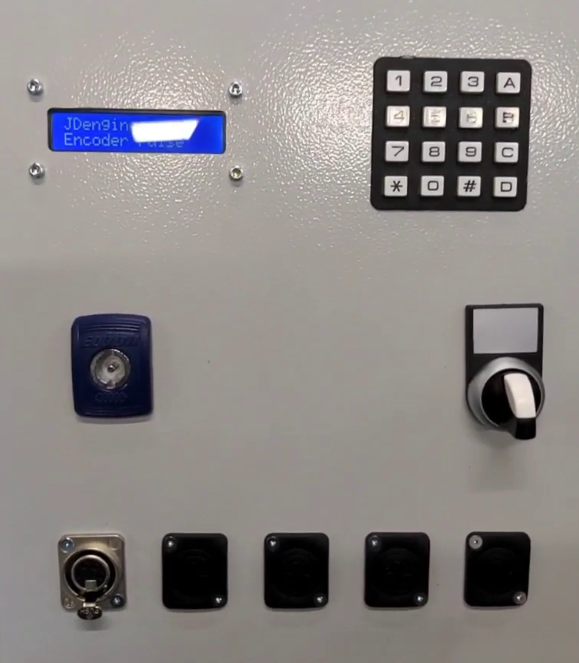

# rotaryPulserInt
rotaryPulser based on ATmega328 using Timer1 interrupt

Specifications by JDJ Electronics / JD Engeneers

Firmware by Willem Aandewiel

## uses:
<pre>
https://github.com/Chris--A/Keypad
https://github.com/fdebrabander/Arduino-LiquidCrystal-I2C-library
</pre>

## Optinal compile options
<code>#define JDJEPCB</code> for alternative connections

## Functions

### [0]-[9] .. +[A] Set single pulse mode
Set frequency of pulse-A and pulse-B to keyed-in number

example: 1200A -> sets frequency to 1200Hz

### [0]-[9] .. +[B] sets sweep from active frequency to keyed-in number
Set high sweep frequency

example: 5000B -> with first input (1200) will sweep from 1200Hz to 5000Hz in 5 seconds and back to 1200Hz

### [*]+[A] select potmeter as input
Selects potmeter as frequency input, cancelles sweep mode

### [C] Clear input, stop pulse
Pulse will stop, any input will be cleared

### [0]-[9] .. +[D] sets sweep time in seconds
Minimal sweep time is 3 seconds, maximum is 20 seconds

example: 8D -> sweep time set to 8 seconds

